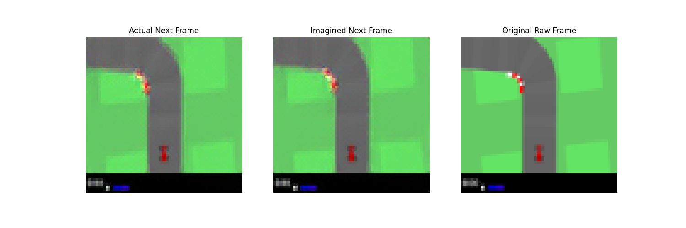

### World Model for CarRacing-v3
PyTorch를 활용하여 OpenAI Gym의 CarRacing 환경에서 에이전트의 미래 상태를 예측하는 World Model 구현 프로젝트

### Model Architecture

1. Vision State Abstraction: EMA(Exponential Moving Average) 기반의 VQ-VAE를 사용하여 고차원 이미지 데이터를 이산적(Discrete) 잠재 토큰으로 압축

2. Sequence Modeling: World Transformer를 이용해 과거 프레임과 액션 데이터를 바탕으로 미래의 잠재 토큰을 예측

---------------------------------------------------------------

### Result

​
